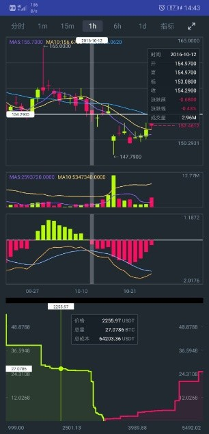
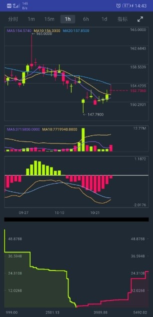

# InteractiveChart

#### 介绍
这是一个交互性二维图表库，现支持k线图（蜡烛图），分时图，深度图，三种主图绘制。支持交易量图，MACD，RSI，KDJ，BOLL等副图的绘制。支持MA平均指标，游标指示器，marker标签等图表附加组件的添加。数据支持分页加载，实时推送等方式。支持长按选中，缩放，单击等常规手势交互。

通过在xml中或者修改attribute类中的属性来自定义Style，具体使用见Demo

  
 。
